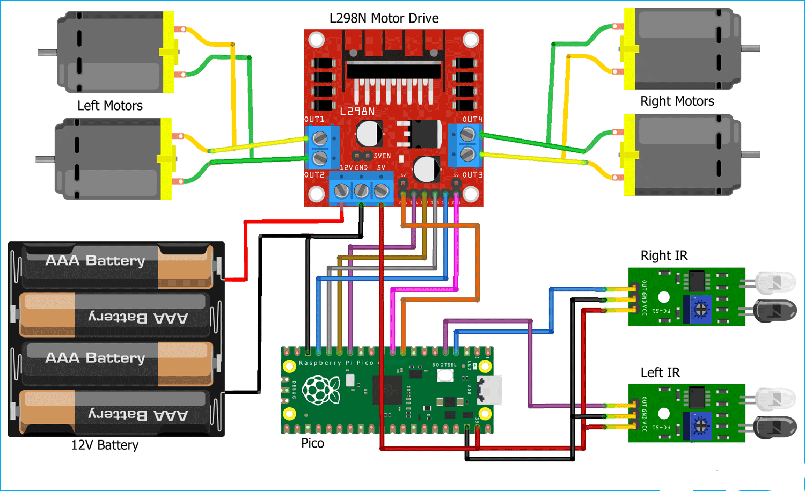

# Line Following Car

:::info 

**Author**: Oana-Roxana Lascu \
**GitHub Project Link**: 

:::

## Description

My project consists of a line-following car, powered by state-of-the-art IR sensors, motor drivers, and the Raspberry Pi Pico microcontroller. This compact yet powerful combination allows for precise line detection and smooth motor control, enabling the car to follow predefined paths with accuracy.

## Motivation

My main motivation was my passion for Formula 1 and cars, which led me to create a line-following car, using a Raspberry Pi Pico W board. This project offers hands-on experience in automotive technology, by delving into the complexity of autonomous systems on a smaller scale. Moreover, the knowledge gained serves as a springboard for reaching more ambitious projects in the future, from advanced driver-assistance systems to electric vehicle design.

## Architecture 

The project architecture consists of a Raspberry Pi board, a motor driver (L298N), four DC motors, a chassis, and a line following sensor array.

The Raspberry Pi board is the main controller of the car, responsible for processing sensor data and controlling the motors. It is connected to the motor driver, the line following sensor array, and the power supply.

The L298N motor driver is used to control the speed and direction of the DC motors. It is connected to the Raspberry Pi board via the GPIO pins, and to the DC motors via the motor output terminals. The motor driver receives control signals from the Raspberry Pi board and adjusts the motor speed and direction accordingly.

The DC motors are responsible for moving the robot. They are connected to the motor driver via the motor output terminals, and receive control signals from the motor driver.

The chassis is the physical structure of the robot, which houses the DC motors, the motor driver, and the Raspberry Pi board. It also provides a platform for mounting the line following sensor array.

The line following sensor array consists of two IR sensors that detect the line for the robot to follow. It is connected to the Raspberry Pi board via the GPIO pins, and provides sensor data to the Raspberry Pi board for processing.

## Log

### Week 6 - 12 May

### Week 7 - 19 May

### Week 20 - 26 May

## Hardware

The Raspberry Pi Pico W board is a versatile computer, which serves as the central control unit of the line following car project. It processes data from the IR sensors to detect the line on the track and sends commands to the motor driver to adjust the car's movement accordingly. Its GPIO pins facilitate communication with peripheral devices, such as the motor driver and IR sensors.

The motor driver, specifically the L298N in this project, plays a crucial role in controlling the speed and direction of the DC motors. It receives commands from the Raspberry Pi board and translates them into signals that regulate the motors' rotation. By interfacing with the Raspberry Pi board, the motor driver enables precise maneuvering of the line following car along the track.

The line following sensor array, consisting of two IR sensors, is essential for guiding the line following car along its path. These sensors detect the contrast between the track and its surroundings, allowing the Raspberry Pi board to maintain the car's position relative to the line. By continuously monitoring the sensor data, the Raspberry Pi board ensures that the car stays on course, making timely adjustments as necessary.

The DC motors are responsible for propelling the line following car forward and steering it along the track. Controlled by the motor driver, these motors react to commands from the Raspberry Pi board to adjust their speed and direction. Their performance ensures that the line following car navigates challenging terrain with stability.

The chassis provides the structural framework for the line following car, housing all its components securely. It offers stability and protection to the internal circuitry, ensuring reliable operation. Additionally, the chassis serves as a mounting platform for the motor driver, Raspberry Pi board, and IR sensors, providing easy assembly and maintenance of the project.

### Schematics

### Bill of Materials

| Device | Usage | Price |
|--------|--------|-------|
|[Rapspberry Pi Pico W](https://www.raspberrypi.com/documentation/microcontrollers/raspberry-pi-pico.html)| The microcontroller | [35 RON](https://www.optimusdigital.ro/en/raspberry-pi-boards/12394-raspberry-pi-pico-w.html)|

|[Car](https://cdn.ozdisan.com/ETicaret_Dosya/729231_182181.pdf)| The chasis | [75 RON](https://www.sigmanortec.ro/Kit-sasiu-Smart-Car-4WD-p136281803)|

|[L298N Dual H-Bridge Motor Driver](https://components101.com/sites/default/files/component_datasheet/L298N-Motor-Driver-Datasheet.pdf) | The motor driver | [9 RON] (https://www.optimusdigital.ro/ro/drivere-de-motoare-cu-perii/145-driver-de-motoare-dual-l298n.html?search_query=l298n&results=4)

|[IR sensor modules](https://www.circuits-diy.com/hw201-infrared-ir-sensor-module/) | The infrared sensors | [7 RON]
(https://www.optimusdigital.ro/ro/senzori-senzori-optici/4514-senzor-infrarosu-de-obstacole.html?search_query=senzor+infrarosu&results=121)

## Software

This projects include an initial version of code, running in Python. The code has not yet reached it's full potential, but it was used for testing of the hardware components and of the electronical realiability.

## Links

1. [Build a Line Follower Robot with Pi Pico: Step-by-Step Guide](https://www.instructables.com/Line-Follower-Robot-With-Pi-Pico/)
2. [DIY Guide: Creating a Line Tracking Robot with Raspberry Pi Pico Board](https://srituhobby.com/how-to-make-a-line-tracking-robot-with-raspberry-pi-pico-board/)
3. [Raspberry Pi Python Line Following Project: Complete Tutorial](https://projects.raspberrypi.org/en/projects/rpi-python-line-following/2)
4. [Raspberry Pi Pico-based Line Follower Robot: GitHub Repository](https://github.com/devancakra/Raspberry-Pi-Pico-based-Line-Follower-Robot)
